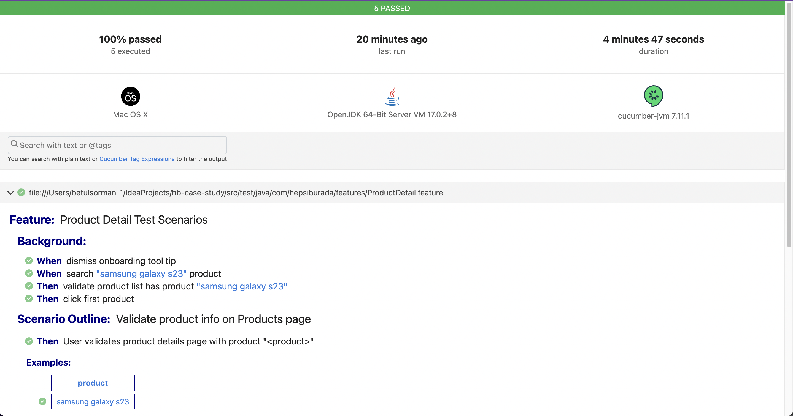

# Mobile Automation Testing with Appium in Java

This project is a project prepared for case study. It uses Java as the programming language, Cucumber for
behavior-driven development (BDD), and Appium for mobile application testing.

## Technologies

- [Maven](https://maven.apache.org/) - Build automation tool
- [Appium](https://appium.io/) - Mobile Automation library
- An Android Emulator/Simulator or real device
- [Cucumber](https://cucumber.io/) - BDD
- Log4J - Logging framework

## Prerequisites

- Java Development Kit (JDK) - 17

The following software are required:

- java : Download and Install java 17
  ```sh
  https://www.openlogic.com/openjdk-downloads
  ```
- Maven must be configured

## Setup

1. **Clone the repository:**

    ```
    https://github.com/betulsorman/hb-case-study.git
    ```

2. **Navigate to the project directory:**

    ```
    cd hb-case-study
    ```

3. **Install dependencies:**

    ```
    mvn install
    ```

4. **Edit Test Capabilities:**

   Open `Capabilities.java` and modify the `DesiredCapabilities` according to your test device and application.

## Running Tests

To run tests, you can either run them through your IDE or via the command line.

- **Command Line:**

    ```
    mvn test
    ```

- **IntelliJ IDEA:**

- Right-click the TestRunner on the runners directory and choose "Run 'TestRunner'".

## Reporting

- Screen recording is saved automatically after test scenarios completed `Android_Emulator_Device/videos` folder.
- Report is automatically generated after tests completed by cucumber under `target/cucumber/report.html`



- **Application.log**: General logs related to the application are found in this file.-
- **Server.log**: General logs related to the server are found in this file.


